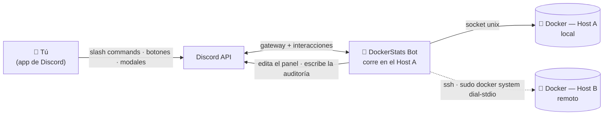
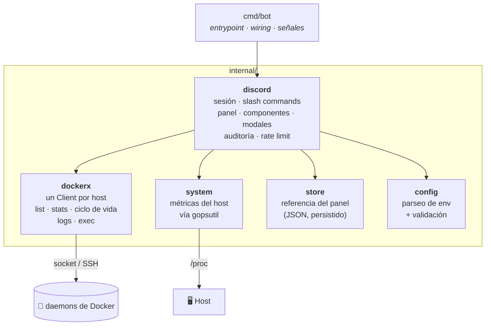
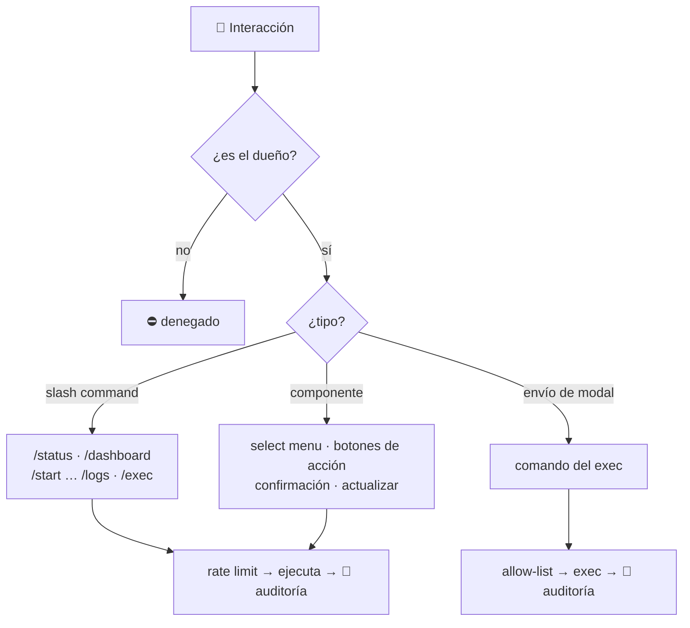
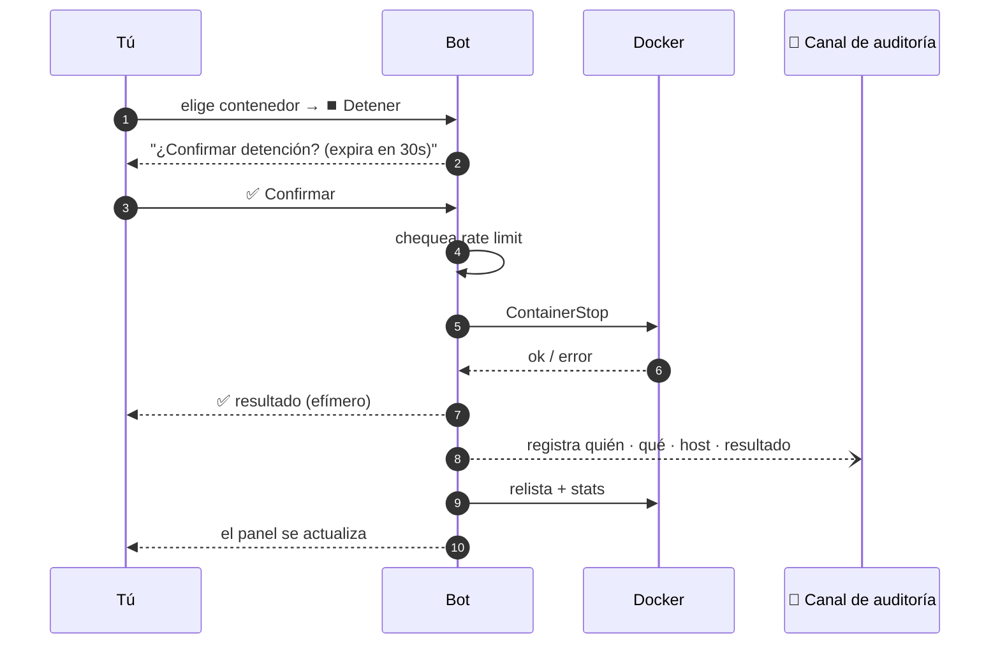

<div align="center">

# 🐳 DockerStats Discord Bot

**Monitorea y controla tus contenedores Docker — en varios servidores — directo desde Discord, hasta desde el celular.**


[English](README.md) · [Português 🇧🇷](README.pt-BR.md) · **Español 🌎**

</div>

---

## 🚀 TL;DR

Un **bot privado de Discord** que convierte un canal en un panel de control en
vivo de tus hosts Docker. Publica un mensaje que **se actualiza solo cada 60s**
con CPU, RAM, disco y el estado de los contenedores — además de botones para
**iniciar / detener / reiniciar / pausar**, leer **logs** y ejecutar **comandos**
dentro de ellos. Un solo bot administra **varios servidores**. Solo *tú* lo ves o
lo usas.

> Piénsalo como un `docker ps` + `docker stats` + `docker start/stop` que vive en tu bolsillo.

<div align="center">

```text
┌────────────────────────────────────────────────┐
│  🖥️ Oracle Main                    🟢 online     │
│  ⚙️ CPU 12.4%    🧠 RAM 1.9/7.6 GiB   💾 34%     │
│  📦 Contenedores (6/7 en ejecución)             │
│   🟢 saki-bot        CPU  2.1% · RAM  88 MiB     │
│   🟢 manager-db      CPU  0.4% · RAM 120 MiB     │
│   🔴 old-worker      Exited (0) 3 days ago       │
│  ──────────────────────────────────────────────  │
│  [ ⚙️ Administrar un contenedor… ▾ ] [ 🔄 Actualizar ]│
└────────────────────────────────────────────────┘
```

*El panel es un único mensaje que el bot edita una y otra vez — sin spam.*

</div>

---

## ✨ Características

| | Función | Descripción |
|---|---|---|
| 📊 | **Panel en vivo** | Un mensaje fijo, actualizado cada 60s, con métricas del host y de los contenedores. |
| 🕹️ | **Controles interactivos** | Botones para iniciar / detener / reiniciar / pausar / reanudar — sin escribir. |
| 🌐 | **Multi-host** | Un bot, varios hosts Docker (socket local **y** remotos por SSH). |
| 📜 | **Logs** | Logs recientes; la salida grande llega como adjunto `.log`. |
| ⌨️ | **Exec** | Ejecuta un comando dentro de un contenedor mediante un modal de Discord. |
| ✅ | **Confirmaciones de seguridad** | Las acciones destructivas piden confirmación y expiran en 30s. |
| 🧾 | **Registro de auditoría** | Cada acción se registra en un canal dedicado (quién, qué, resultado). |
| 🔒 | **Privado por diseño** | Restringido a un único dueño; los comandos están ocultos para los demás. |
| 💾 | **Sobrevive a reinicios** | El panel recuerda su mensaje y lo sigue editando tras reiniciar. |

---

## 📑 Tabla de contenidos

- [🏗️ Arquitectura](#️-arquitectura)
  - [Vista de sistema](#vista-de-sistema)
  - [Arquitectura del código](#arquitectura-del-código)
  - [Cómo se enruta una interacción](#cómo-se-enruta-una-interacción)
  - [Anatomía de una acción](#anatomía-de-una-acción)
  - [Cómo funcionan los hosts remotos](#cómo-funcionan-los-hosts-remotos)
- [🎮 Comandos](#-comandos)
- [🚀 Inicio rápido (un solo host)](#-inicio-rápido-un-solo-host)
- [🌐 Configuración multi-host](#-configuración-multi-host)
- [⚙️ Referencia de configuración](#️-referencia-de-configuración)
- [🔒 Seguridad](#-seguridad)
- [🩺 Solución de problemas](#-solución-de-problemas)
- [🗂️ Estructura del proyecto](#️-estructura-del-proyecto)
- [🛣️ Roadmap](#️-roadmap)
- [🤝 Contribuir](#-contribuir) · [📄 Licencia](#-licencia)

---

## 🏗️ Arquitectura

> **¿Recién llegas?** Lee la *Vista de sistema* de abajo y sáltate el resto — es
> todo lo que necesitas para usarlo. Los demás diagramas son para quien quiere
> ver las tripas.

### Vista de sistema

El bot corre en **una** máquina y se comunica con uno o más daemons de Docker. Al
daemon local se llega por su socket Unix; a los remotos, por **SSH** usando el
`docker system dial-stdio` integrado de Docker — sin puertos expuestos y sin
agente en el host remoto.



### Arquitectura del código

Pequeño, en capas y fácil de extender. La **capa de Discord nunca importa los
tipos de Docker directamente** — habla con `dockerx`, así que agregar un host o
un comando es un cambio localizado. Las flechas significan *"depende de"*.



| Paquete | Responsabilidad |
|---|---|
| `cmd/bot` | Punto de entrada: carga la config, arma los hosts, inicia el bot, maneja el apagado. |
| `internal/config` | Lee y valida variables de entorno (una vez, al arrancar). |
| `internal/dockerx` | Todo lo de Docker: un `Client` por host, list/stats/ciclo de vida, logs, exec. |
| `internal/system` | CPU/RAM/disco/uptime del host vía `gopsutil` (sin invocar shell). |
| `internal/store` | Persiste la referencia `canal + mensaje` del panel para sobrevivir reinicios. |
| `internal/discord` | El bot: sesión, comandos, panel en vivo, botones/modales, auditoría y rate limit. |

### Cómo se enruta una interacción

Cada interacción se autoriza primero y luego se despacha por tipo.



### Anatomía de una acción

Lo que pasa de punta a punta al detener un contenedor desde el panel:



### Cómo funcionan los hosts remotos

<details>
<summary><b>¿Por qué SSH + <code>sudo docker system dial-stdio</code>?</b> (clic para expandir)</summary>

<br/>

Para los hosts remotos el bot lanza:

```bash
ssh -i <clave> user@remoto  sudo docker system dial-stdio
```

Ese comando convierte la conexión SSH en un túnel transparente hacia el socket de
Docker remoto. Usar **`sudo` sin contraseña** significa que **no** tienes que
agregar el usuario SSH al grupo `docker` ni cambiar nada en el host remoto — el
bot solo necesita una clave SSH y un usuario con sudo. Si un host remoto se cae,
su sección en el panel aparece como `🔌 offline` y el resto sigue funcionando.

</details>

---

## 🎮 Comandos

Todos los comandos son **exclusivos del dueño** y están ocultos para los demás
miembros (`DefaultMemberPermissions = 0`). Los nombres de contenedor tienen
autocompletado; en configuraciones multi-host, el host aparece junto a cada nombre.

| Comando | Qué hace |
|---|---|
| `/dashboard` | 📌 Fija el panel en vivo (auto-actualizable) en el canal actual. |
| `/status` | 📸 Envía una foto puntual de los hosts + contenedores. |
| `/start <contenedor>` | ▶️ Inicia un contenedor. |
| `/stop <contenedor>` | ⏹️ Detiene un contenedor de forma graceful. |
| `/restart <contenedor>` | 🔄 Reinicia un contenedor. |
| `/pause <contenedor>` | ⏸️ Pausa (congela) un contenedor. |
| `/unpause <contenedor>` | ▶️ Reanuda un contenedor pausado. |
| `/logs <contenedor> [minutos]` | 📜 Logs recientes (ventana de tiempo; adjunta `.log` si es grande). |
| `/exec <contenedor>` | ⌨️ Abre un modal para ejecutar un comando dentro del contenedor. |

El panel además agrega un **menú de contenedores**, botones de acción **según el
estado**, un botón **📜 Logs** y un botón **🔄 Actualizar ahora**.

---

## 🚀 Inicio rápido (un solo host)

**Vas a necesitar:** una máquina con Docker y un token de bot de Discord.

**1. Crea el bot en Discord**
- [Discord Developer Portal](https://discord.com/developers/applications) → **New Application** → **Bot** → **Reset Token** → cópialo.
- Invítalo a *tu* servidor (OAuth2 → scopes `bot` + `applications.commands`).

**2. Obtén tus IDs** — activa el **Modo Desarrollador** (*Ajustes → Avanzado*) y haz clic derecho:
- en tu **perfil → Copiar ID de usuario** → `DISCORD_OWNER_ID`
- en el **ícono del servidor → Copiar ID del servidor** → `DISCORD_GUILD_ID` *(opcional; hace que los comandos aparezcan al instante)*

**3. Configura y ejecuta**

```bash
git clone https://github.com/the-eduardo/DockerStats-Discord-Bot
cd DockerStats-Discord-Bot
cp .env.example .env
nano .env         # completa DISCORD_TOKEN, DISCORD_OWNER_ID, DISCORD_GUILD_ID

docker compose up -d --build
```

**4. Úsalo** — escribe `/dashboard` en el canal que quieras. Listo. 🎉

```bash
docker compose logs -f      # seguir los logs
docker compose down         # detener el bot
```

---

## 🌐 Configuración multi-host

<details>
<summary><b>Haz que el bot en el Host A también administre el Host B</b> (clic para expandir)</summary>

<br/>

**En el host remoto (B):**
- Acceso SSH desde el Host A usando una clave privada.
- El usuario SSH tiene **`sudo` sin contraseña** (`sudo -n docker ps` debe funcionar).

**En el host que corre el bot (A):**

1. Coloca la clave privada donde solo root pueda leerla (para que `ssh` la acepte):

   ```bash
   sudo mkdir -p /root/dsbot-secrets
   sudo cp hostB.key /root/dsbot-secrets/master.key
   sudo chown root:root /root/dsbot-secrets/master.key
   sudo chmod 600 /root/dsbot-secrets/master.key
   ```

   El `docker-compose.yml` ya monta ese archivo en modo solo lectura dentro del
   contenedor en `/root/.ssh/master.key`.

2. Agrega el host remoto a tu `.env`:

   ```dotenv
   # formato: key,Etiqueta,ssh://user@ip[,/ruta/de/la/clave]   (";" separa varios hosts)
   REMOTE_HOSTS=master,Oracle Master,ssh://ubuntu@203.0.113.10,/root/.ssh/master.key
   ```

3. Reconstruye: `docker compose up -d --build`

Al arrancar, el log muestra `host remoto "master" OK` cuando el túnel funciona. El
panel entonces renderiza **una sección por host**, y cada menú/comando reconoce el host.

> La imagen del bot ya trae `openssh-client`; la conexión usa
> `StrictHostKeyChecking=accept-new` y `BatchMode=yes`.

</details>

---

## ⚙️ Referencia de configuración

Toda la configuración es por variables de entorno (ver [`.env.example`](.env.example)).

| Variable | Requerida | Predeterminado | Descripción |
|---|:---:|---|---|
| `DISCORD_TOKEN` | ✅ | — | El token de tu bot. |
| `DISCORD_OWNER_ID` | ✅ | — | El único usuario autorizado a usar el bot. |
| `DISCORD_GUILD_ID` | ➖ | *(global)* | ID del servidor; hace que los slash commands se registren al instante. |
| `HOSTNAME` | ➖ | `Machine` | Etiqueta del host local en el panel. |
| `SHUTDOWN_TIMEOUT` | ➖ | `10` | Timeout de detención/reinicio graceful en segundos (0–300). |
| `DISK_PATH` | ➖ | `/host` | Ruta medida para el uso de disco (el compose monta el `/` del host en `/host`). |
| `DASHBOARD_CHANNEL_ID` | ➖ | — | Canal inicial opcional del panel (`/dashboard` también lo define). |
| `REFRESH_SECONDS` | ➖ | `60` | Intervalo de actualización del panel (10–3600). |
| `DATA_DIR` | ➖ | `/app/data` | Dónde se persiste la referencia del panel (un volumen con nombre). |
| `REMOTE_HOSTS` | ➖ | — | Hosts remotos, ver [multi-host](#-configuración-multi-host). |
| `AUDIT_CHANNEL_ID` | ➖ | — | Canal donde se registra cada acción. Vacío = auditoría desactivada. |
| `EXEC_ALLOWLIST` | ➖ | — | Prefijos de comando permitidos en `/exec`, separados por coma. Vacío = sin restricción. |

---

## 🔒 Seguridad

- **Bloqueo de dueño único.** Cada interacción se verifica contra `DISCORD_OWNER_ID`,
  y los comandos se registran con `DefaultMemberPermissions = 0`, así que ni
  aparecen para otros miembros. Usa un **servidor privado** para el bot.
- **`/exec` es poderoso.** Da una shell *dentro* de tus contenedores vía Discord.
  Trata tu cuenta de Discord como una credencial de tus servidores — activa 2FA.
- **Socket de Docker = root.** Cualquier proceso con acceso a
  `/var/run/docker.sock` tiene, en la práctica, root en ese host. El bot corre
  como root dentro de su contenedor justo por eso; por lo demás el contenedor es mínimo.
- **Claves remotas.** La clave SSH que permite al Host A alcanzar al Host B se
  guarda `root:root 600` y se monta en solo lectura. Si el Host A se ve
  comprometido, el Host B también queda alcanzable — un trade-off inherente al
  diseño de un solo bot.

**🛡️ Hardening incorporado**

- 🧾 **Registro de auditoría** — define `AUDIT_CHANNEL_ID` y cada acción (quién,
  qué, host, contenedor, comando del exec, resultado) se publica ahí.
- 🔒 **Allow-list de `/exec`** — define `EXEC_ALLOWLIST` (ej.: `ls,cat,df`) para
  restringir el exec a prefijos específicos; el encadenamiento (`;`, `&&`, `|`, …)
  se bloquea mientras esté activa. Es una barrera, no un sandbox completo.
- ⏳ **Rate limiting** — un token bucket contiene ráfagas de acciones mutables
  para evitar toques rápidos accidentales.

---

## 🩺 Solución de problemas

| Síntoma | Causa y solución |
|---|---|
| Los comandos no aparecen | Define `DISCORD_GUILD_ID` (instantáneo) en lugar de esperar hasta ~1h por el registro global. |
| `host remoto "..." INACESSÍVEL` | Verifica que `ssh -i clave user@ip sudo docker ps` funcione desde el Host A; revisa sudo sin contraseña y permisos de la clave (`600`, `root:root`). |
| El comando de logs da timeout | Algunas versiones del daemon **se cuelgan con `docker logs --tail`**; este bot usa `--since` (ventana de tiempo) para evitarlo. |
| El bot se reconecta / las interacciones fallan | Estás corriendo **dos bots con el mismo token**. Solo una sesión de gateway por token — retira el duplicado. |
| RAM/uptime del host parecen los del contenedor | Las métricas leen el `/proc` del host; asegúrate de que el contenedor no tenga límite de memoria (el compose por defecto está bien). |

---

## 🗂️ Estructura del proyecto

```text
cmd/bot/            entrypoint (main)
internal/
  config/           carga y valida las variables de entorno
  dockerx/          capa Docker: list, ciclo de vida, stats, logs, exec (un Client por host)
  system/           métricas del host vía gopsutil (CPU, RAM, disco, uptime)
  store/            persiste la referencia del panel (canal + id del mensaje) en JSON
  discord/          sesión, slash commands, panel, componentes, auditoría, rate limit
.github/workflows/  CI (vet + build multi-arch) y Release (imagen multi-arch → GHCR)
```

**Notas de diseño para los curiosos**

- **Un embed reutilizable** arma tanto la foto de `/status` como el panel auto-actualizable.
- **IDs de componente sin estado** codifican `acción:host:contenedor`, así el bot sobrevive reinicios sin estado de UI en memoria (las confirmaciones usan tokens de corta duración).
- **Métricas sin invocar shell** — stats del host vía `gopsutil`, de los contenedores vía Docker Stats API (dos muestras, como `docker stats`).
- **Build multi-arch** — el Dockerfile es multi-stage y respeta `TARGETARCH`; compila nativo en ARM64 (ej.: Oracle Ampere) y cross-compila para `amd64` vía `docker buildx`. El CI publica una imagen multi-arch en **GHCR** en las tags.

---

## 🛣️ Roadmap

- [x] Panel en vivo auto-actualizable
- [x] Controles interactivos (start/stop/restart/pause) con confirmaciones
- [x] Logs y exec
- [x] Multi-host por SSH
- [x] Canal de auditoría para cada acción
- [x] Rate limiting y allow-list para `/exec`
- [x] Imagen multi-arch publicada vía CI (GHCR)
- [ ] Endpoint de métricas Prometheus (se aceptan ideas)

---

## 🤝 Contribuir

Los issues y PRs son bienvenidos. El código es Go pequeño e idiomático, fácil de
extender — un comando nuevo suele ser un handler más una entrada en la lista.

## 📄 Licencia

Licenciado bajo la **Apache License 2.0** — ver [LICENSE](LICENSE).

---

<div align="center">
<sub>Hecho con <a href="https://github.com/bwmarrin/discordgo">discordgo</a> ·
Docker SDK · <a href="https://github.com/shirou/gopsutil">gopsutil</a>.
Úsalo con responsabilidad — eres responsable de lo que el bot haga en tus máquinas.</sub>
</div>
