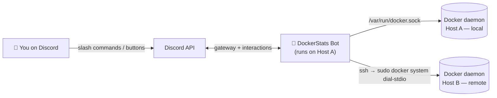
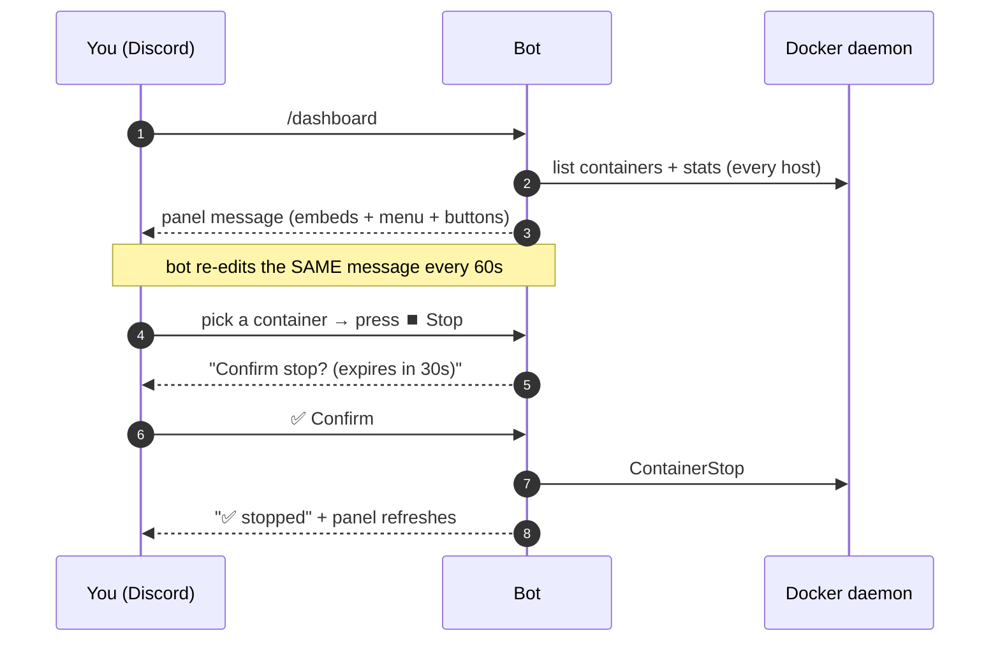

<div align="center">

# 🐳 DockerStats Discord Bot

**Monitor and control your Docker containers — across multiple servers — straight from Discord, even on your phone.**


**English** · [Português 🇧🇷](README.pt-BR.md)

</div>

---

## 📖 What is this?

DockerStats is a **private Discord bot** that turns a Discord channel into a live
control panel for your Docker hosts. It posts a message that **updates itself
every 60 seconds** with CPU, RAM, disk and the status of every container — and
gives you buttons to **start, stop, restart, pause** containers, read their
**logs**, and even **run commands inside them**.

It’s designed for one person (you): only your Discord account can see or use it.
Perfect for keeping an eye on a couple of VPSs from your phone without opening an
SSH terminal.

> **In one sentence:** it’s a `docker ps` + `docker stats` + `docker start/stop`
> that lives in your pocket, on Discord.

<div align="center">

```text
┌────────────────────────────────────────────┐
│  🖥️ Oracle Main                             │
│  ⚙️ CPU 12.4%   🧠 RAM 1.9/7.6 GiB   💾 …    │
│  📦 Containers (6/7 running)                │
│   🟢 saki-bot        CPU  2.1% · RAM 88 MiB │
│   🟢 manager-db      CPU  0.4% · RAM 120 MiB│
│   🔴 old-worker      Exited (0) 3 days ago  │
│  ────────────────────────────────────────  │
│  [ ⚙️ Manage a container… ▾ ]  [ 🔄 Refresh ]│
└────────────────────────────────────────────┘
```

*The panel above is a live message the bot keeps editing.*

</div>

---

## ✨ Features

| | Feature | Description |
|---|---|---|
| 📊 | **Live dashboard** | A pinned message auto-refreshed every 60s with host + container metrics. |
| 🕹️ | **Interactive controls** | Buttons to start / stop / restart / pause / unpause — no typing required. |
| 🌐 | **Multi-host** | One bot controls several Docker hosts (local socket **and** remote over SSH). |
| 📜 | **Logs** | Read recent container logs; large output is delivered as a `.log` attachment. |
| ⌨️ | **Exec** | Run a command inside a container through a Discord modal. |
| ✅ | **Safety confirmations** | Destructive actions (stop/restart) ask for confirmation and expire in 30s. |
| 🔒 | **Private by design** | Locked to a single owner ID; commands are hidden from everyone else. |
| 💾 | **Survives restarts** | The panel remembers its message and keeps editing it after a reboot. |

---

## 📑 Table of Contents

- [How it works (architecture)](#-how-it-works)
- [Commands](#-commands)
- [Quick start (single host)](#-quick-start-single-host)
- [Multi-host setup (advanced)](#-multi-host-setup-advanced)
- [Configuration reference](#-configuration-reference)
- [Security](#-security)
- [Troubleshooting](#-troubleshooting)
- [Project layout](#-project-layout)
- [Roadmap](#-roadmap)
- [License](#-license)

---

## 🧠 How it works

The bot runs on **one** machine and talks to one or more Docker daemons. The
local daemon is reached through its Unix socket; remote daemons are reached over
SSH using Docker’s built-in `docker system dial-stdio` — **no ports exposed, no
agent installed on the remote host.**



### What happens when you use it



### Why SSH + `sudo docker system dial-stdio`?

For remote hosts the bot spawns:

```bash
ssh -i <key> user@remote  sudo docker system dial-stdio
```

That command turns the SSH connection into a transparent tunnel to the remote
Docker socket. Using `sudo` (passwordless) means **you don’t have to add the SSH
user to the `docker` group** or change anything on the remote host — the bot
just needs an SSH key and a sudo-capable user.

---

## 🎮 Commands

All commands are **owner-only** and hidden from other members
(`DefaultMemberPermissions = 0`). Container names support autocomplete; on
multi-host setups the host is shown next to each name.

| Command | What it does |
|---|---|
| `/dashboard` | Pins the live auto-updating panel in the current channel. |
| `/status` | Sends a one-off snapshot of hosts + containers. |
| `/start <container>` | Starts a container. |
| `/stop <container>` | Gracefully stops a container. |
| `/restart <container>` | Restarts a container. |
| `/pause <container>` | Pauses (freezes) a container. |
| `/unpause <container>` | Resumes a paused container. |
| `/logs <container> [minutes]` | Recent logs (time window; attaches `.log` if large). |
| `/exec <container>` | Opens a modal to run a command inside the container. |

On the panel itself you also get a **container picker menu**, state-aware action
buttons, a **📜 Logs** button, and a **🔄 Refresh now** button.

---

## 🚀 Quick start (single host)

**You’ll need:** a machine with Docker, and a Discord bot token.

### 1. Create the Discord bot

1. Go to the [Discord Developer Portal](https://discord.com/developers/applications) → **New Application**.
2. Open **Bot** → **Reset Token** → copy the token.
3. Invite the bot to *your* server (OAuth2 URL Generator → scopes `bot` + `applications.commands`).

### 2. Get your IDs

Enable **Developer Mode** in Discord (*Settings → Advanced*), then right-click:

- **your profile → Copy User ID** → this is `DISCORD_OWNER_ID`.
- **your server icon → Copy Server ID** → this is `DISCORD_GUILD_ID` (optional, but makes commands appear instantly).

### 3. Configure & run

```bash
git clone https://github.com/the-eduardo/DockerStats-Discord-Bot
cd DockerStats-Discord-Bot
cp .env.example .env
nano .env         # fill DISCORD_TOKEN, DISCORD_OWNER_ID, DISCORD_GUILD_ID

docker compose up -d --build
```

### 4. Use it

In your server, type `/dashboard` in the channel where you want the panel. Done. 🎉

```bash
docker compose logs -f      # follow the logs
docker compose down         # stop the bot
```

---

## 🌐 Multi-host setup (advanced)

Have the bot on **Host A** also manage **Host B**.

**Requirements on the remote host (B):**
- SSH access from Host A using a private key.
- The SSH user has **passwordless `sudo`** (`sudo -n docker ps` must work).

**On the host running the bot (A):**

1. Place the private key somewhere only root can read (so `ssh` accepts it):

   ```bash
   sudo mkdir -p /root/dsbot-secrets
   sudo cp hostB.key /root/dsbot-secrets/master.key
   sudo chown root:root /root/dsbot-secrets/master.key
   sudo chmod 600 /root/dsbot-secrets/master.key
   ```

   The provided `docker-compose.yml` already mounts this file read-only into the
   container at `/root/.ssh/master.key`.

2. Add the remote host to your `.env`:

   ```dotenv
   # format: key,Label,ssh://user@ip[,/path/to/key]   (";" separates multiple hosts)
   REMOTE_HOSTS=master,Oracle Master,ssh://ubuntu@203.0.113.10,/root/.ssh/master.key
   ```

3. Rebuild:

   ```bash
   docker compose up -d --build
   ```

On boot the log will show `host remoto "master" OK` when the tunnel works. The
panel now renders **one section per host**, and every menu/command is
host-aware. If a remote host goes down, its section shows as `🔌 offline` and the
rest keeps working.

> The bot image ships with `openssh-client`; the SSH connection uses
> `StrictHostKeyChecking=accept-new` and `BatchMode=yes`.

---

## ⚙️ Configuration reference

All configuration is via environment variables (see [`.env.example`](.env.example)).

| Variable | Required | Default | Description |
|---|:---:|---|---|
| `DISCORD_TOKEN` | ✅ | — | Your bot token. |
| `DISCORD_OWNER_ID` | ✅ | — | The only user allowed to use the bot. |
| `DISCORD_GUILD_ID` | ➖ | *(global)* | Server ID; makes slash commands register instantly. |
| `HOSTNAME` | ➖ | `Machine` | Label for the local host in the panel. |
| `SHUTDOWN_TIMEOUT` | ➖ | `10` | Graceful stop/restart timeout in seconds (0–300). |
| `DISK_PATH` | ➖ | `/host` | Path measured for host disk usage (compose mounts host `/` at `/host`). |
| `DASHBOARD_CHANNEL_ID` | ➖ | — | Optional initial channel for the panel (`/dashboard` also sets it). |
| `REFRESH_SECONDS` | ➖ | `60` | Panel refresh interval (10–3600). |
| `DATA_DIR` | ➖ | `/app/data` | Where the panel reference is persisted (a named volume). |
| `REMOTE_HOSTS` | ➖ | — | Remote hosts, see [multi-host](#-multi-host-setup-advanced). |
| `AUDIT_CHANNEL_ID` | ➖ | — | Channel where every action is logged. Empty = auditing off. |
| `EXEC_ALLOWLIST` | ➖ | — | Comma-separated allowed command prefixes for `/exec`. Empty = unrestricted. |

---

## 🔒 Security

- **Single-owner lock.** Every interaction is checked against `DISCORD_OWNER_ID`,
  and commands are registered with `DefaultMemberPermissions = 0`, so they don’t
  even appear for other members. Use a **private server** for the bot.
- **`/exec` is powerful.** It gives a shell *inside* your containers via Discord.
  Treat your Discord account as a credential to your servers — enable 2FA.
- **Docker socket = root.** Any process with access to `/var/run/docker.sock`
  effectively has root on that host. The bot runs as root inside its container
  for exactly this reason; the container is otherwise minimal.
- **Remote keys.** The SSH key that lets Host A reach Host B is stored `root:root
  600` and mounted read-only. If Host A is compromised, Host B is reachable too —
  an inherent trade-off of the single-bot design.

**Built-in hardening:**

- **Audit log** — set `AUDIT_CHANNEL_ID` and every action (who, what, host,
  container, exec command, result) is posted to that channel. Essential once
  `/exec` is in play.
- **`/exec` allow-list** — set `EXEC_ALLOWLIST` (e.g. `ls,cat,df`) to restrict
  exec to specific command prefixes; command chaining (`;`, `&&`, `|`, …) is
  blocked while the allow-list is active. It’s a guardrail, not a full sandbox.
- **Rate limiting** — a token bucket caps bursts of mutating actions to prevent
  accidental rapid taps.

---

## 🩺 Troubleshooting

| Symptom | Cause & fix |
|---|---|
| Commands don’t appear | Set `DISCORD_GUILD_ID` (instant) instead of waiting up to ~1h for global registration. |
| `host remoto "..." INACESSÍVEL` | Check `ssh -i key user@ip sudo docker ps` works from Host A; verify passwordless sudo and key permissions (`600`, `root:root`). |
| Logs command times out | Some daemon versions **hang on `docker logs --tail`**; this bot uses `--since` (time window) precisely to avoid that. |
| Bot keeps reconnecting / interactions fail | You’re running **two bots on the same token**. Only one gateway session per token — retire the duplicate. |
| Host RAM/uptime look like the container’s | Metrics read the host `/proc`; ensure the bot container isn’t memory-limited (default compose is fine). |

---

## 🗂 Project layout

```text
cmd/bot/            entrypoint (main)
internal/
  config/           loads & validates environment variables
  dockerx/          Docker layer: list, start/stop/restart/pause, stats, logs, exec
                    (one Client per host; remote hosts via SSH)
  system/           host metrics via gopsutil (CPU, RAM, disk, uptime)
  store/            persists the panel reference (channel + message id) as JSON
  discord/          session, slash commands, panel, interactive components
```

**Design notes**

- **Layered & host-agnostic.** The Discord layer never imports Docker types
  directly — it talks to `dockerx.Client`. Adding a host is just another client.
- **One reusable embed.** The same builder produces the `/status` snapshot and
  the auto-updating panel.
- **Stateless component IDs.** Buttons encode `action:host:container`, so the bot
  survives restarts without in-memory UI state (confirmations use short-lived
  tokens).
- **Metrics without shelling out.** Host stats come from `gopsutil` and container
  stats from the Docker Stats API (two samples, like `docker stats`) — no
  `mpstat`/`free`/`docker` CLI processes.

Build is a multi-stage, multi-arch Dockerfile (`TARGETARCH`); it compiles natively
on ARM64 (e.g. Oracle Ampere) and cross-builds for `amd64` via `docker buildx`.

---

## 🛣 Roadmap

- [x] Live auto-updating dashboard
- [x] Interactive controls (start/stop/restart/pause) with confirmations
- [x] Logs & exec
- [x] Multi-host over SSH
- [x] Audit log channel for every action
- [x] Rate limiting & `/exec` allow-list
- [x] Multi-arch image published via CI (GHCR)

---

## 🤝 Contributing

Issues and PRs are welcome. The codebase is small, idiomatic Go and easy to
extend — a new command is usually one handler plus one entry in the command list.

## 📄 License

Licensed under the **Apache License 2.0** — see [LICENSE](LICENSE).

---

<div align="center">
<sub>Built with <a href="https://github.com/bwmarrin/discordgo">discordgo</a> ·
the Docker SDK · <a href="https://github.com/shirou/gopsutil">gopsutil</a>.
Use responsibly — you are responsible for what the bot does on your machines.</sub>
</div>
