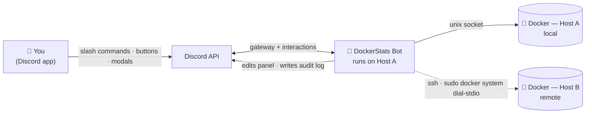
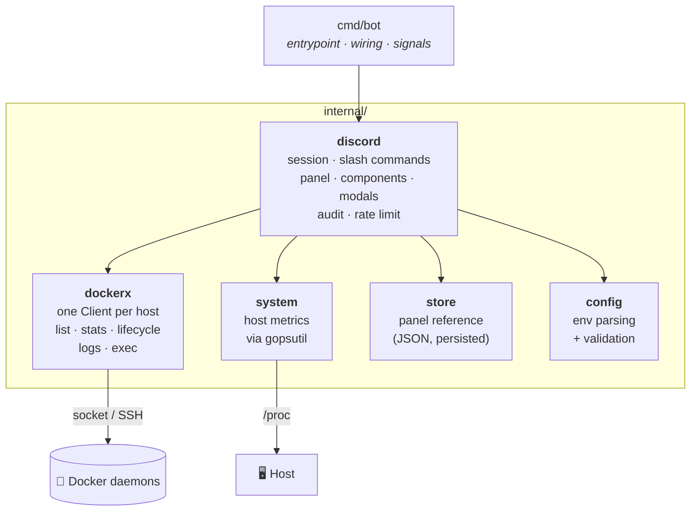
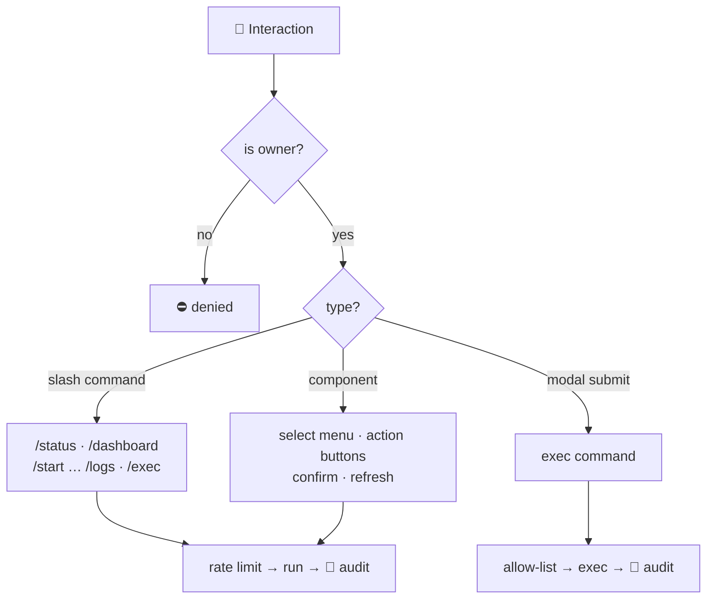
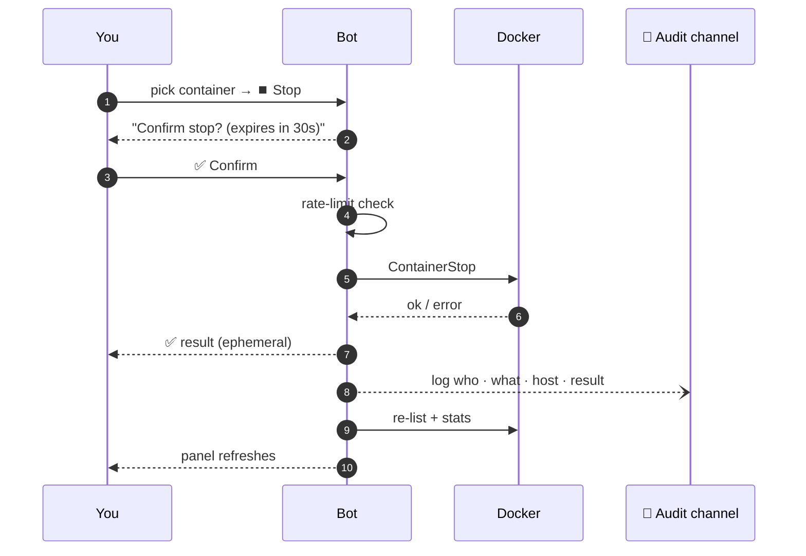

<div align="center">

# 🐳 DockerStats Discord Bot

**Monitor and control your Docker containers — across multiple servers — straight from Discord, even on your phone.**


**English** · [Português 🇧🇷](README.pt-BR.md) · [Español 🌎](README.es.md)

</div>

---

## 🚀 TL;DR

A **private Discord bot** that turns a channel into a live control panel for your
Docker hosts. It posts a message that **updates itself every 60s** with CPU, RAM,
disk and container status — plus buttons to **start / stop / restart / pause**
containers, read **logs**, and run **commands** inside them. One bot can manage
**several servers** at once. Only *you* can see or use it.

> Think `docker ps` + `docker stats` + `docker start/stop`, living in your pocket.

<div align="center">

```text
┌────────────────────────────────────────────────┐
│  🖥️ Oracle Main                    🟢 online     │
│  ⚙️ CPU 12.4%    🧠 RAM 1.9/7.6 GiB   💾 34%     │
│  📦 Containers (6/7 running)                     │
│   🟢 saki-bot        CPU  2.1% · RAM  88 MiB     │
│   🟢 manager-db      CPU  0.4% · RAM 120 MiB     │
│   🔴 old-worker      Exited (0) 3 days ago       │
│  ──────────────────────────────────────────────  │
│  [ ⚙️ Manage a container… ▾ ]   [ 🔄 Refresh ]    │
└────────────────────────────────────────────────┘
```

*The panel is a single message the bot keeps editing — no spam.*

</div>

---

## ✨ Features

| | Feature | Description |
|---|---|---|
| 📊 | **Live dashboard** | A pinned message auto-refreshed every 60s with host + container metrics. |
| 🕹️ | **Interactive controls** | Buttons to start / stop / restart / pause / unpause — no typing. |
| 🌐 | **Multi-host** | One bot, many Docker hosts (local socket **and** remote over SSH). |
| 📜 | **Logs** | Recent container logs; big output is delivered as a `.log` attachment. |
| ⌨️ | **Exec** | Run a command inside a container via a Discord modal. |
| ✅ | **Safety confirmations** | Destructive actions ask for confirmation and expire in 30s. |
| 🧾 | **Audit log** | Every action is recorded to a dedicated channel (who, what, result). |
| 🔒 | **Private by design** | Locked to a single owner; commands are hidden from everyone else. |
| 💾 | **Survives restarts** | The panel remembers its message and keeps editing it after a reboot. |

---

## 📑 Table of Contents

- [🏗️ Architecture](#️-architecture)
  - [System view](#system-view)
  - [Code architecture](#code-architecture)
  - [How an interaction is routed](#how-an-interaction-is-routed)
  - [Anatomy of one action](#anatomy-of-one-action)
  - [How remote hosts work](#how-remote-hosts-work)
- [🎮 Commands](#-commands)
- [🚀 Quick start (single host)](#-quick-start-single-host)
- [🌐 Multi-host setup](#-multi-host-setup)
- [⚙️ Configuration reference](#️-configuration-reference)
- [🔒 Security](#-security)
- [🩺 Troubleshooting](#-troubleshooting)
- [🗂️ Project layout](#️-project-layout)
- [🛣️ Roadmap](#️-roadmap)
- [🤝 Contributing](#-contributing) · [📄 License](#-license)

---

## 🏗️ Architecture

> **New here?** Read the *System view* below and skip the rest — that's all you
> need to run it. The other diagrams are for developers who want the internals.

### System view

The bot runs on **one** machine and talks to one or more Docker daemons. The
local daemon is reached through its Unix socket; remote daemons are reached over
**SSH** using Docker's built-in `docker system dial-stdio` — no ports exposed, no
agent installed on the remote host.



### Code architecture

Small, layered, and easy to extend. The **Discord layer never imports Docker
types directly** — it talks to `dockerx`, so adding a host or a command is a
localized change. Arrows mean *"depends on"*.



| Package | Responsibility |
|---|---|
| `cmd/bot` | Entry point: load config, build hosts, start the bot, handle shutdown. |
| `internal/config` | Read & validate environment variables (once, at boot). |
| `internal/dockerx` | Everything Docker: a `Client` per host, container list/stats/lifecycle, logs, exec. |
| `internal/system` | Host CPU/RAM/disk/uptime via `gopsutil` (no shelling out). |
| `internal/store` | Persists the panel's `channel + message` reference so it survives restarts. |
| `internal/discord` | The bot: session, commands, the live panel, buttons/modals, audit & rate limit. |

### How an interaction is routed

Every interaction is authorized first, then dispatched by type.



### Anatomy of one action

What happens end-to-end when you stop a container from the panel:



### How remote hosts work

<details>
<summary><b>Why SSH + <code>sudo docker system dial-stdio</code>?</b> (click to expand)</summary>

<br/>

For remote hosts the bot spawns:

```bash
ssh -i <key> user@remote  sudo docker system dial-stdio
```

That command turns the SSH connection into a transparent tunnel to the remote
Docker socket. Using **passwordless `sudo`** means you **don't** have to add the
SSH user to the `docker` group or change anything on the remote host — the bot
just needs an SSH key and a sudo-capable user. If a remote host is unreachable,
its panel section shows as `🔌 offline` and everything else keeps working.

</details>

---

## 🎮 Commands

All commands are **owner-only** and hidden from other members
(`DefaultMemberPermissions = 0`). Container names support autocomplete; on
multi-host setups the host is shown next to each name.

| Command | What it does |
|---|---|
| `/dashboard` | 📌 Pins the live auto-updating panel in the current channel. |
| `/status` | 📸 Sends a one-off snapshot of hosts + containers. |
| `/start <container>` | ▶️ Starts a container. |
| `/stop <container>` | ⏹️ Gracefully stops a container. |
| `/restart <container>` | 🔄 Restarts a container. |
| `/pause <container>` | ⏸️ Pauses (freezes) a container. |
| `/unpause <container>` | ▶️ Resumes a paused container. |
| `/logs <container> [minutes]` | 📜 Recent logs (time window; attaches `.log` if large). |
| `/exec <container>` | ⌨️ Opens a modal to run a command inside the container. |

The panel itself adds a **container picker menu**, **state-aware** action buttons,
a **📜 Logs** button, and a **🔄 Refresh now** button.

---

## 🚀 Quick start (single host)

**You'll need:** a machine with Docker, and a Discord bot token.

**1. Create the Discord bot**
- [Discord Developer Portal](https://discord.com/developers/applications) → **New Application** → **Bot** → **Reset Token** → copy it.
- Invite it to *your* server (OAuth2 → scopes `bot` + `applications.commands`).

**2. Get your IDs** — enable **Developer Mode** (*Settings → Advanced*), then right-click:
- your **profile → Copy User ID** → `DISCORD_OWNER_ID`
- your **server icon → Copy Server ID** → `DISCORD_GUILD_ID` *(optional; makes commands appear instantly)*

**3. Configure & run**

```bash
git clone https://github.com/the-eduardo/DockerStats-Discord-Bot
cd DockerStats-Discord-Bot
cp .env.example .env
nano .env         # fill DISCORD_TOKEN, DISCORD_OWNER_ID, DISCORD_GUILD_ID

docker compose up -d --build
```

**4. Use it** — type `/dashboard` in the channel you want. Done. 🎉

```bash
docker compose logs -f      # follow the logs
docker compose down         # stop the bot
```

---

## 🌐 Multi-host setup

<details>
<summary><b>Have the bot on Host A also manage Host B</b> (click to expand)</summary>

<br/>

**On the remote host (B):**
- SSH access from Host A using a private key.
- The SSH user has **passwordless `sudo`** (`sudo -n docker ps` must work).

**On the host running the bot (A):**

1. Place the private key where only root can read it (so `ssh` accepts it):

   ```bash
   sudo mkdir -p /root/dsbot-secrets
   sudo cp hostB.key /root/dsbot-secrets/master.key
   sudo chown root:root /root/dsbot-secrets/master.key
   sudo chmod 600 /root/dsbot-secrets/master.key
   ```

   The provided `docker-compose.yml` already mounts this file read-only into the
   container at `/root/.ssh/master.key`.

2. Add the remote host to your `.env`:

   ```dotenv
   # format: key,Label,ssh://user@ip[,/path/to/key]   (";" separates multiple hosts)
   REMOTE_HOSTS=master,Oracle Master,ssh://ubuntu@203.0.113.10,/root/.ssh/master.key
   ```

3. Rebuild: `docker compose up -d --build`

On boot the log shows `host remoto "master" OK` when the tunnel works. The panel
then renders **one section per host**, and every menu/command is host-aware.

> The bot image ships with `openssh-client`; the connection uses
> `StrictHostKeyChecking=accept-new` and `BatchMode=yes`.

</details>

---

## ⚙️ Configuration reference

All configuration is via environment variables (see [`.env.example`](.env.example)).

| Variable | Required | Default | Description |
|---|:---:|---|---|
| `DISCORD_TOKEN` | ✅ | — | Your bot token. |
| `DISCORD_OWNER_ID` | ✅ | — | The only user allowed to use the bot. |
| `DISCORD_GUILD_ID` | ➖ | *(global)* | Server ID; makes slash commands register instantly. |
| `HOSTNAME` | ➖ | `Machine` | Label for the local host in the panel. |
| `SHUTDOWN_TIMEOUT` | ➖ | `10` | Graceful stop/restart timeout in seconds (0–300). |
| `DISK_PATH` | ➖ | `/host` | Path measured for host disk usage (compose mounts host `/` at `/host`). |
| `DASHBOARD_CHANNEL_ID` | ➖ | — | Optional initial channel for the panel (`/dashboard` also sets it). |
| `REFRESH_SECONDS` | ➖ | `60` | Panel refresh interval (10–3600). |
| `DATA_DIR` | ➖ | `/app/data` | Where the panel reference is persisted (a named volume). |
| `REMOTE_HOSTS` | ➖ | — | Remote hosts, see [multi-host](#-multi-host-setup). |
| `AUDIT_CHANNEL_ID` | ➖ | — | Channel where every action is logged. Empty = auditing off. |
| `EXEC_ALLOWLIST` | ➖ | — | Comma-separated allowed command prefixes for `/exec`. Empty = unrestricted. |

---

## 🔒 Security

- **Single-owner lock.** Every interaction is checked against `DISCORD_OWNER_ID`,
  and commands register with `DefaultMemberPermissions = 0`, so they don't even
  appear for other members. Use a **private server** for the bot.
- **`/exec` is powerful.** It gives a shell *inside* your containers via Discord.
  Treat your Discord account as a credential to your servers — enable 2FA.
- **Docker socket = root.** Any process with access to `/var/run/docker.sock`
  effectively has root on that host. The bot runs as root inside its container
  for exactly this reason; the container is otherwise minimal.
- **Remote keys.** The SSH key that lets Host A reach Host B is stored `root:root
  600` and mounted read-only. If Host A is compromised, Host B is reachable too —
  an inherent trade-off of the single-bot design.

**🛡️ Built-in hardening**

- 🧾 **Audit log** — set `AUDIT_CHANNEL_ID` and every action (who, what, host,
  container, exec command, result) is posted there.
- 🔒 **`/exec` allow-list** — set `EXEC_ALLOWLIST` (e.g. `ls,cat,df`) to restrict
  exec to specific prefixes; command chaining (`;`, `&&`, `|`, …) is blocked while
  active. A guardrail, not a full sandbox.
- ⏳ **Rate limiting** — a token bucket caps bursts of mutating actions to prevent
  accidental rapid taps.

---

## 🩺 Troubleshooting

| Symptom | Cause & fix |
|---|---|
| Commands don't appear | Set `DISCORD_GUILD_ID` (instant) instead of waiting up to ~1h for global registration. |
| `host remoto "..." INACESSÍVEL` | Check `ssh -i key user@ip sudo docker ps` works from Host A; verify passwordless sudo and key perms (`600`, `root:root`). |
| Logs command times out | Some daemon versions **hang on `docker logs --tail`**; this bot uses `--since` (time window) to avoid that. |
| Bot keeps reconnecting / interactions fail | You're running **two bots on the same token**. Only one gateway session per token — retire the duplicate. |
| Host RAM/uptime look like the container's | Metrics read the host `/proc`; ensure the bot container isn't memory-limited (default compose is fine). |

---

## 🗂️ Project layout

```text
cmd/bot/            entrypoint (main)
internal/
  config/           loads & validates environment variables
  dockerx/          Docker layer: list, lifecycle, stats, logs, exec (one Client per host)
  system/           host metrics via gopsutil (CPU, RAM, disk, uptime)
  store/            persists the panel reference (channel + message id) as JSON
  discord/          session, slash commands, panel, components, audit, rate limit
.github/workflows/  CI (vet + multi-arch build) and Release (multi-arch image → GHCR)
```

**Design notes for the curious**

- **One reusable embed** builds both the `/status` snapshot and the auto-updating panel.
- **Stateless component IDs** encode `action:host:container`, so the bot survives restarts without in-memory UI state (confirmations use short-lived tokens).
- **Metrics without shelling out** — host stats from `gopsutil`, container stats from the Docker Stats API (two samples, like `docker stats`).
- **Multi-arch build** — the Dockerfile is multi-stage and honors `TARGETARCH`; it compiles natively on ARM64 (e.g. Oracle Ampere) and cross-builds for `amd64` via `docker buildx`. CI publishes a multi-arch image to **GHCR** on tags.

---

## 🛣️ Roadmap

- [x] Live auto-updating dashboard
- [x] Interactive controls (start/stop/restart/pause) with confirmations
- [x] Logs & exec
- [x] Multi-host over SSH
- [x] Audit log channel for every action
- [x] Rate limiting & `/exec` allow-list
- [x] Multi-arch image published via CI (GHCR)
- [ ] Prometheus/metrics endpoint (ideas welcome)

---

## 🤝 Contributing

Issues and PRs are welcome. The codebase is small, idiomatic Go and easy to
extend — a new command is usually one handler plus one entry in the command list.

## 📄 License

Licensed under the **Apache License 2.0** — see [LICENSE](LICENSE).

---

<div align="center">
<sub>Built with <a href="https://github.com/bwmarrin/discordgo">discordgo</a> ·
the Docker SDK · <a href="https://github.com/shirou/gopsutil">gopsutil</a>.
Use responsibly — you are responsible for what the bot does on your machines.</sub>
</div>
