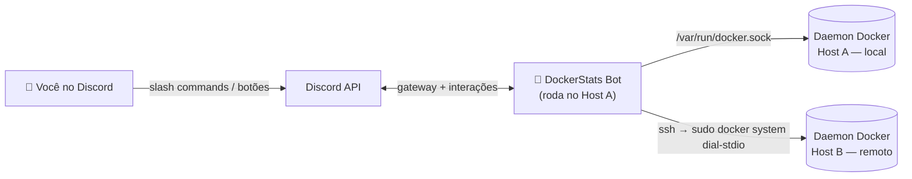
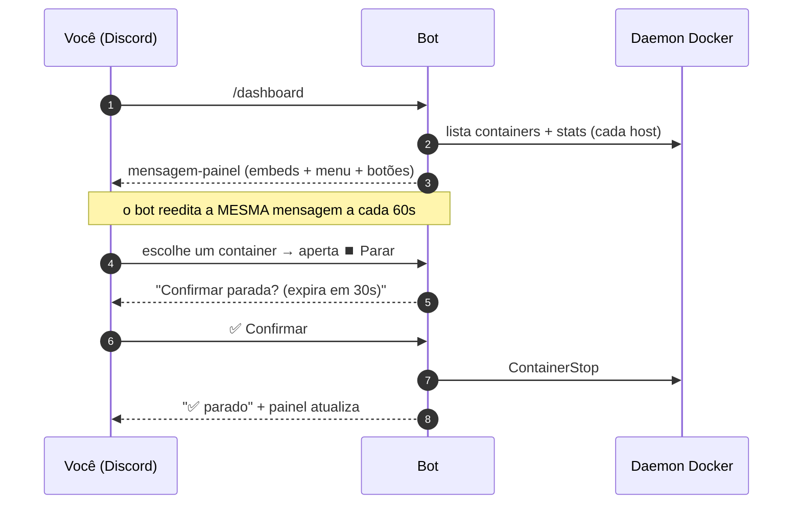

<div align="center">

# 🐳 DockerStats Discord Bot

**Monitore e controle seus containers Docker — em vários servidores — direto do Discord, até pelo celular.**


[English](README.md) · **Português 🇧🇷**

</div>

---

## 📖 O que é isso?

O DockerStats é um **bot privado de Discord** que transforma um canal do Discord
em um painel de controle ao vivo dos seus hosts Docker. Ele publica uma mensagem
que **se atualiza sozinha a cada 60 segundos** com CPU, RAM, disco e o status de
cada container — e te dá botões para **iniciar, parar, reiniciar e pausar**
containers, ler os **logs** deles e até **rodar comandos por dentro**.

Foi feito para uma pessoa só (você): apenas a sua conta do Discord consegue ver
ou usar. Perfeito para acompanhar um par de VPSs pelo celular sem abrir um
terminal SSH.

> **Em uma frase:** é um `docker ps` + `docker stats` + `docker start/stop` que
> mora no seu bolso, no Discord.

<div align="center">

```text
┌────────────────────────────────────────────┐
│  🖥️ Oracle Main                             │
│  ⚙️ CPU 12.4%   🧠 RAM 1.9/7.6 GiB   💾 …    │
│  📦 Containers (6/7 rodando)               │
│   🟢 saki-bot        CPU  2.1% · RAM 88 MiB │
│   🟢 manager-db      CPU  0.4% · RAM 120 MiB│
│   🔴 old-worker      Exited (0) 3 days ago  │
│  ────────────────────────────────────────  │
│  [ ⚙️ Gerenciar um container… ▾ ] [ 🔄 Atualizar ]│
└────────────────────────────────────────────┘
```

*O painel acima é uma mensagem viva que o bot fica editando.*

</div>

---

## ✨ Funcionalidades

| | Recurso | Descrição |
|---|---|---|
| 📊 | **Painel ao vivo** | Uma mensagem fixa, atualizada a cada 60s, com métricas do host e dos containers. |
| 🕹️ | **Controles interativos** | Botões para iniciar / parar / reiniciar / pausar / retomar — sem digitar nada. |
| 🌐 | **Multi-host** | Um bot controla vários hosts Docker (socket local **e** remotos via SSH). |
| 📜 | **Logs** | Lê logs recentes; saída grande vem como anexo `.log`. |
| ⌨️ | **Exec** | Roda um comando dentro de um container por um modal do Discord. |
| ✅ | **Confirmação de segurança** | Ações destrutivas (parar/reiniciar) pedem confirmação e expiram em 30s. |
| 🔒 | **Privado por natureza** | Restrito a um único dono (owner ID); comandos ficam ocultos para todos os outros. |
| 💾 | **Sobrevive a restart** | O painel lembra da sua mensagem e continua editando-a após reiniciar. |

---

## 📑 Sumário

- [Como funciona (arquitetura)](#-como-funciona)
- [Comandos](#-comandos)
- [Início rápido (single-host)](#-início-rápido-single-host)
- [Configuração multi-host (avançado)](#-configuração-multi-host-avançado)
- [Referência de configuração](#-referência-de-configuração)
- [Segurança](#-segurança)
- [Solução de problemas](#-solução-de-problemas)
- [Estrutura do projeto](#-estrutura-do-projeto)
- [Roadmap](#-roadmap)
- [Licença](#-licença)

---

## 🧠 Como funciona

O bot roda em **uma** máquina e conversa com um ou mais daemons Docker. O daemon
local é acessado pelo socket Unix; os daemons remotos são acessados via SSH
usando o `docker system dial-stdio` embutido do Docker — **sem portas expostas e
sem instalar agente no host remoto.**



### O que acontece quando você usa



### Por que SSH + `sudo docker system dial-stdio`?

Para hosts remotos, o bot dispara:

```bash
ssh -i <chave> user@remoto  sudo docker system dial-stdio
```

Esse comando transforma a conexão SSH em um túnel transparente até o socket do
Docker remoto. Usar `sudo` (sem senha) significa que você **não precisa
adicionar o usuário SSH ao grupo `docker`** nem mudar nada no host remoto — o bot
só precisa de uma chave SSH e um usuário com sudo.

---

## 🎮 Comandos

Todos os comandos são **exclusivos do dono** e ocultos para os outros membros
(`DefaultMemberPermissions = 0`). Nomes de container têm autocomplete; em setups
multi-host, o host aparece ao lado de cada nome.

| Comando | O que faz |
|---|---|
| `/dashboard` | Fixa o painel ao vivo (auto-atualizável) no canal atual. |
| `/status` | Envia um retrato pontual dos hosts + containers. |
| `/start <container>` | Inicia um container. |
| `/stop <container>` | Para um container de forma graceful. |
| `/restart <container>` | Reinicia um container. |
| `/pause <container>` | Pausa (congela) um container. |
| `/unpause <container>` | Retoma um container pausado. |
| `/logs <container> [minutos]` | Logs recentes (janela de tempo; anexa `.log` se for grande). |
| `/exec <container>` | Abre um modal para rodar um comando dentro do container. |

No próprio painel você também tem um **menu de containers**, botões de ação
cientes do estado, um botão **📜 Logs** e um botão **🔄 Atualizar agora**.

---

## 🚀 Início rápido (single-host)

**Você vai precisar de:** uma máquina com Docker e um token de bot do Discord.

### 1. Crie o bot no Discord

1. Vá ao [Discord Developer Portal](https://discord.com/developers/applications) → **New Application**.
2. Abra **Bot** → **Reset Token** → copie o token.
3. Convide o bot para o *seu* servidor (OAuth2 URL Generator → escopos `bot` + `applications.commands`).

### 2. Pegue seus IDs

Ative o **Modo Desenvolvedor** no Discord (*Configurações → Avançado*) e clique com o botão direito:

- **no seu perfil → Copiar ID do usuário** → esse é o `DISCORD_OWNER_ID`.
- **no ícone do servidor → Copiar ID do servidor** → esse é o `DISCORD_GUILD_ID` (opcional, mas faz os comandos aparecerem na hora).

### 3. Configure e rode

```bash
git clone https://github.com/the-eduardo/DockerStats-Discord-Bot
cd DockerStats-Discord-Bot
cp .env.example .env
nano .env         # preencha DISCORD_TOKEN, DISCORD_OWNER_ID, DISCORD_GUILD_ID

docker compose up -d --build
```

### 4. Use

No seu servidor, digite `/dashboard` no canal onde quer o painel. Pronto. 🎉

```bash
docker compose logs -f      # acompanhar os logs
docker compose down         # parar o bot
```

---

## 🌐 Configuração multi-host (avançado)

Faça o bot no **Host A** também gerenciar o **Host B**.

**Requisitos no host remoto (B):**
- Acesso SSH a partir do Host A usando uma chave privada.
- O usuário SSH tem **`sudo` sem senha** (`sudo -n docker ps` precisa funcionar).

**No host que roda o bot (A):**

1. Coloque a chave privada num lugar que só o root leia (para o `ssh` aceitá-la):

   ```bash
   sudo mkdir -p /root/dsbot-secrets
   sudo cp hostB.key /root/dsbot-secrets/master.key
   sudo chown root:root /root/dsbot-secrets/master.key
   sudo chmod 600 /root/dsbot-secrets/master.key
   ```

   O `docker-compose.yml` já monta esse arquivo read-only dentro do container em
   `/root/.ssh/master.key`.

2. Adicione o host remoto ao seu `.env`:

   ```dotenv
   # formato: key,Rótulo,ssh://user@ip[,/caminho/da/chave]   (";" separa vários hosts)
   REMOTE_HOSTS=master,Oracle Master,ssh://ubuntu@203.0.113.10,/root/.ssh/master.key
   ```

3. Rebuild:

   ```bash
   docker compose up -d --build
   ```

No boot, o log mostra `host remoto "master" OK` quando o túnel funciona. O painel
passa a renderizar **uma seção por host**, e todo menu/comando fica ciente do
host. Se um host remoto cair, a seção dele aparece como `🔌 offline` e o resto
continua funcionando.

> A imagem do bot já vem com `openssh-client`; a conexão SSH usa
> `StrictHostKeyChecking=accept-new` e `BatchMode=yes`.

---

## ⚙️ Referência de configuração

Toda a configuração é por variáveis de ambiente (veja [`.env.example`](.env.example)).

| Variável | Obrigatória | Padrão | Descrição |
|---|:---:|---|---|
| `DISCORD_TOKEN` | ✅ | — | O token do seu bot. |
| `DISCORD_OWNER_ID` | ✅ | — | O único usuário autorizado a usar o bot. |
| `DISCORD_GUILD_ID` | ➖ | *(global)* | ID do servidor; faz os slash commands registrarem na hora. |
| `HOSTNAME` | ➖ | `Machine` | Rótulo do host local no painel. |
| `SHUTDOWN_TIMEOUT` | ➖ | `10` | Timeout de parada/reinício graceful em segundos (0–300). |
| `DISK_PATH` | ➖ | `/host` | Caminho medido para uso de disco (o compose monta o `/` do host em `/host`). |
| `DASHBOARD_CHANNEL_ID` | ➖ | — | Canal inicial opcional do painel (`/dashboard` também define). |
| `REFRESH_SECONDS` | ➖ | `60` | Intervalo de atualização do painel (10–3600). |
| `DATA_DIR` | ➖ | `/app/data` | Onde a referência do painel é persistida (um volume nomeado). |
| `REMOTE_HOSTS` | ➖ | — | Hosts remotos, veja [multi-host](#-configuração-multi-host-avançado). |
| `AUDIT_CHANNEL_ID` | ➖ | — | Canal onde toda ação é registrada. Vazio = auditoria desligada. |
| `EXEC_ALLOWLIST` | ➖ | — | Prefixos de comando permitidos no `/exec`, separados por vírgula. Vazio = sem restrição. |

---

## 🔒 Segurança

- **Trava de dono único.** Toda interação é checada contra o `DISCORD_OWNER_ID`, e
  os comandos são registrados com `DefaultMemberPermissions = 0`, então nem
  aparecem para outros membros. Use um **servidor privado** para o bot.
- **`/exec` é poderoso.** Ele dá um shell *dentro* dos seus containers via
  Discord. Trate sua conta do Discord como uma credencial dos seus servidores —
  ative 2FA.
- **Socket do Docker = root.** Qualquer processo com acesso ao
  `/var/run/docker.sock` tem, na prática, root naquele host. O bot roda como root
  dentro do container exatamente por isso; o container é mínimo no resto.
- **Chaves remotas.** A chave SSH que permite o Host A alcançar o Host B fica
  `root:root 600` e é montada read-only. Se o Host A for comprometido, o Host B
  também fica alcançável — um trade-off inerente ao design de um bot só.

**Hardening embutido:**

- **Audit log** — defina `AUDIT_CHANNEL_ID` e toda ação (quem, o quê, host,
  container, comando do exec, resultado) é publicada nesse canal. Essencial
  quando o `/exec` está em jogo.
- **Allow-list do `/exec`** — defina `EXEC_ALLOWLIST` (ex.: `ls,cat,df`) para
  restringir o exec a prefixos de comando específicos; encadeamento (`;`, `&&`,
  `|`, …) é bloqueado enquanto a allow-list está ativa. É um guardrail, não um
  sandbox completo.
- **Rate limiting** — um token bucket contém rajadas de ações mutáveis para
  evitar toques rápidos acidentais.

---

## 🩺 Solução de problemas

| Sintoma | Causa e correção |
|---|---|
| Comandos não aparecem | Defina `DISCORD_GUILD_ID` (instantâneo) em vez de esperar até ~1h pelo registro global. |
| `host remoto "..." INACESSÍVEL` | Verifique se `ssh -i chave user@ip sudo docker ps` funciona do Host A; confira sudo sem senha e permissões da chave (`600`, `root:root`). |
| Comando de logs dá timeout | Algumas versões do daemon **travam no `docker logs --tail`**; este bot usa `--since` (janela de tempo) justamente para evitar isso. |
| Bot fica reconectando / interações falham | Você está rodando **dois bots com o mesmo token**. Só uma sessão de gateway por token — aposente o duplicado. |
| RAM/uptime do host parecem os do container | As métricas leem o `/proc` do host; garanta que o container do bot não esteja com limite de memória (o compose padrão já está ok). |

---

## 🗂 Estrutura do projeto

```text
cmd/bot/            entrypoint (main)
internal/
  config/           carrega e valida as variáveis de ambiente
  dockerx/          camada Docker: list, start/stop/restart/pause, stats, logs, exec
                    (um Client por host; hosts remotos via SSH)
  system/           métricas do host via gopsutil (CPU, RAM, disco, uptime)
  store/            persiste a referência do painel (canal + id da mensagem) em JSON
  discord/          sessão, slash commands, painel, componentes interativos
```

**Notas de design**

- **Em camadas e agnóstico de host.** A camada do Discord nunca importa os tipos
  do Docker diretamente — ela fala com o `dockerx.Client`. Adicionar um host é só
  mais um client.
- **Um embed reutilizável.** O mesmo builder produz o retrato do `/status` e o
  painel auto-atualizável.
- **IDs de componente sem estado.** Os botões codificam `ação:host:container`,
  então o bot sobrevive a restarts sem estado de UI em memória (as confirmações
  usam tokens de curta duração).
- **Métricas sem chamar shell.** As stats do host vêm do `gopsutil` e as dos
  containers da Docker Stats API (duas amostras, como o `docker stats`) — sem
  processos `mpstat`/`free`/`docker` CLI.

O build é um Dockerfile multi-stage e multi-arch (`TARGETARCH`); compila nativo em
ARM64 (ex.: Oracle Ampere) e cross-compila para `amd64` via `docker buildx`.

---

## 🛣 Roadmap

- [x] Painel ao vivo auto-atualizável
- [x] Controles interativos (start/stop/restart/pause) com confirmações
- [x] Logs e exec
- [x] Multi-host via SSH
- [x] Canal de audit log para cada ação
- [x] Rate limiting e allow-list para o `/exec`
- [x] Imagem multi-arch publicada via CI (GHCR)

---

## 🤝 Contribuindo

Issues e PRs são bem-vindos. O código é Go pequeno e idiomático, fácil de
estender — um comando novo costuma ser um handler mais uma entrada na lista de
comandos.

## 📄 Licença

Licenciado sob a **Apache License 2.0** — veja [LICENSE](LICENSE).

---

<div align="center">
<sub>Feito com <a href="https://github.com/bwmarrin/discordgo">discordgo</a> ·
Docker SDK · <a href="https://github.com/shirou/gopsutil">gopsutil</a>.
Use com responsabilidade — você é responsável pelo que o bot faz nas suas máquinas.</sub>
</div>
