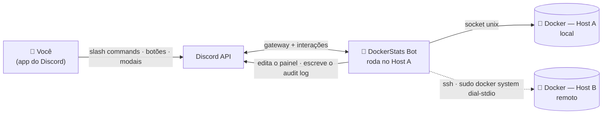
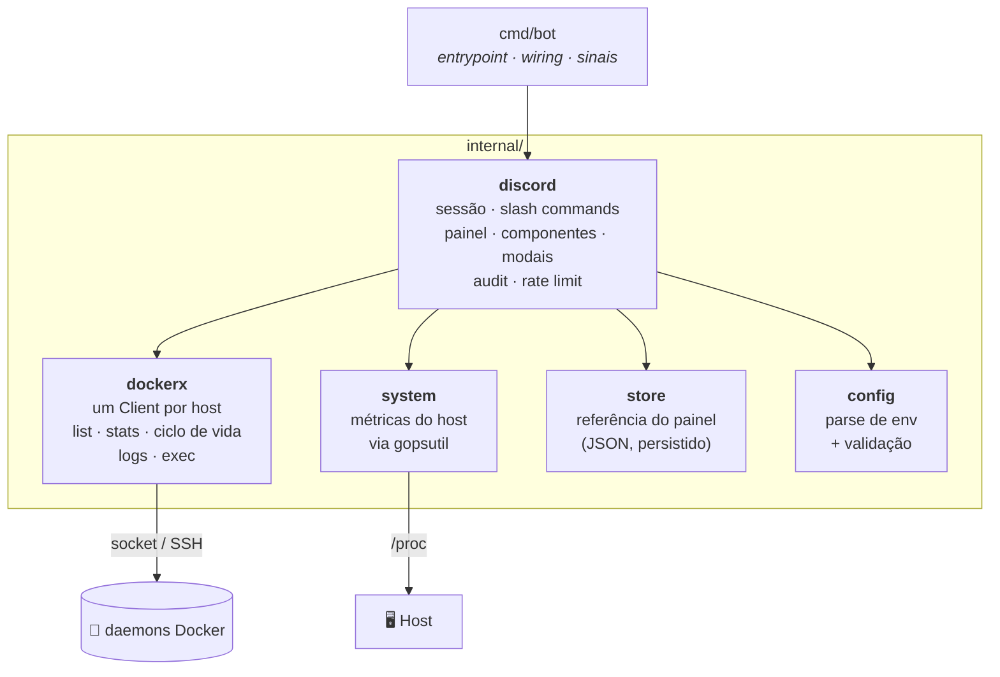
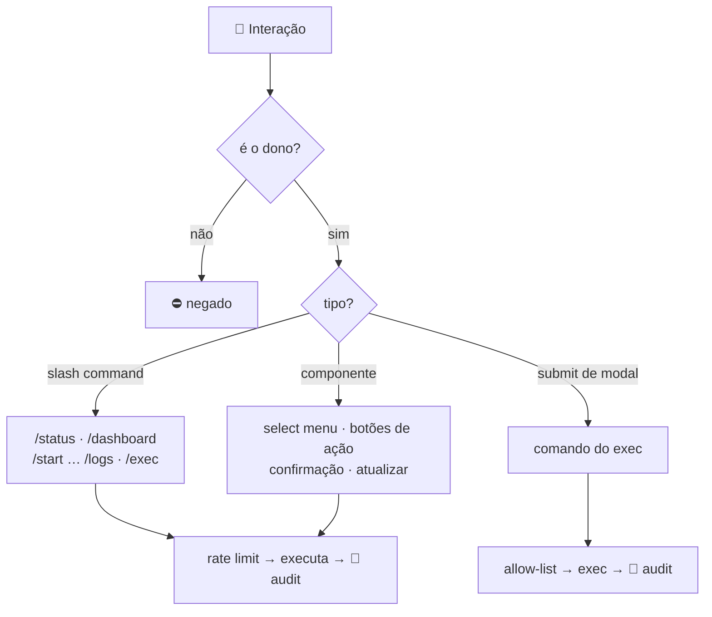
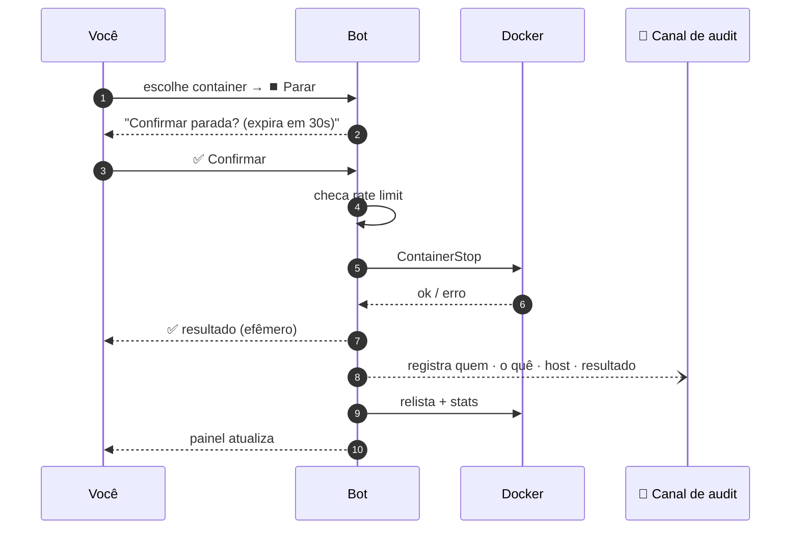

<div align="center">

# 🐳 DockerStats Discord Bot

**Monitore e controle seus containers Docker — em vários servidores — direto do Discord, até pelo celular.**


[English](README.md) · **Português 🇧🇷** · [Español 🌎](README.es.md)

</div>

---

## 🚀 TL;DR

Um **bot privado de Discord** que transforma um canal em um painel de controle ao
vivo dos seus hosts Docker. Ele publica uma mensagem que **se atualiza sozinha a
cada 60s** com CPU, RAM, disco e o status dos containers — além de botões para
**iniciar / parar / reiniciar / pausar**, ler **logs** e rodar **comandos** por
dentro deles. Um bot só gerencia **vários servidores**. Só *você* vê ou usa.

> Pense num `docker ps` + `docker stats` + `docker start/stop` que mora no seu bolso.

<div align="center">

```text
┌────────────────────────────────────────────────┐
│  🖥️ Oracle Main                    🟢 online     │
│  ⚙️ CPU 12.4%    🧠 RAM 1.9/7.6 GiB   💾 34%     │
│  📦 Containers (6/7 rodando)                    │
│   🟢 saki-bot        CPU  2.1% · RAM  88 MiB     │
│   🟢 manager-db      CPU  0.4% · RAM 120 MiB     │
│   🔴 old-worker      Exited (0) 3 days ago       │
│  ──────────────────────────────────────────────  │
│  [ ⚙️ Gerenciar um container… ▾ ]  [ 🔄 Atualizar ]│
└────────────────────────────────────────────────┘
```

*O painel é uma única mensagem que o bot fica editando — sem spam.*

</div>

---

## ✨ Funcionalidades

| | Recurso | Descrição |
|---|---|---|
| 📊 | **Painel ao vivo** | Uma mensagem fixa, atualizada a cada 60s, com métricas do host e dos containers. |
| 🕹️ | **Controles interativos** | Botões para iniciar / parar / reiniciar / pausar / retomar — sem digitar. |
| 🌐 | **Multi-host** | Um bot, vários hosts Docker (socket local **e** remotos via SSH). |
| 📜 | **Logs** | Logs recentes; saída grande vem como anexo `.log`. |
| ⌨️ | **Exec** | Roda um comando dentro de um container por um modal do Discord. |
| ✅ | **Confirmação de segurança** | Ações destrutivas pedem confirmação e expiram em 30s. |
| 🧾 | **Audit log** | Toda ação é registrada num canal dedicado (quem, o quê, resultado). |
| 🔒 | **Privado por natureza** | Restrito a um único dono; comandos ocultos para todos os outros. |
| 💾 | **Sobrevive a restart** | O painel lembra da sua mensagem e continua editando-a após reiniciar. |

---

## 📑 Sumário

- [🏗️ Arquitetura](#️-arquitetura)
  - [Visão de sistema](#visão-de-sistema)
  - [Arquitetura do código](#arquitetura-do-código)
  - [Como uma interação é roteada](#como-uma-interação-é-roteada)
  - [Anatomia de uma ação](#anatomia-de-uma-ação)
  - [Como os hosts remotos funcionam](#como-os-hosts-remotos-funcionam)
- [🎮 Comandos](#-comandos)
- [🚀 Início rápido (single-host)](#-início-rápido-single-host)
- [🌐 Configuração multi-host](#-configuração-multi-host)
- [⚙️ Referência de configuração](#️-referência-de-configuração)
- [🔒 Segurança](#-segurança)
- [🩺 Solução de problemas](#-solução-de-problemas)
- [🗂️ Estrutura do projeto](#️-estrutura-do-projeto)
- [🛣️ Roadmap](#️-roadmap)
- [🤝 Contribuindo](#-contribuindo) · [📄 Licença](#-licença)

---

## 🏗️ Arquitetura

> **Novo por aqui?** Leia a *Visão de sistema* abaixo e pule o resto — é só o que
> você precisa pra rodar. Os outros diagramas são pra quem quer as entranhas.

### Visão de sistema

O bot roda em **uma** máquina e conversa com um ou mais daemons Docker. O daemon
local é acessado pelo socket Unix; os remotos, via **SSH** usando o
`docker system dial-stdio` embutido do Docker — sem portas expostas e sem agente
no host remoto.



### Arquitetura do código

Pequeno, em camadas e fácil de estender. A **camada do Discord nunca importa os
tipos do Docker diretamente** — ela fala com o `dockerx`, então adicionar um host
ou comando é uma mudança localizada. As setas significam *"depende de"*.



| Pacote | Responsabilidade |
|---|---|
| `cmd/bot` | Entrypoint: carrega config, monta hosts, sobe o bot, trata shutdown. |
| `internal/config` | Lê e valida variáveis de ambiente (uma vez, no boot). |
| `internal/dockerx` | Tudo de Docker: um `Client` por host, list/stats/ciclo de vida, logs, exec. |
| `internal/system` | CPU/RAM/disco/uptime do host via `gopsutil` (sem chamar shell). |
| `internal/store` | Persiste a referência `canal + mensagem` do painel p/ sobreviver a restart. |
| `internal/discord` | O bot: sessão, comandos, painel ao vivo, botões/modais, audit e rate limit. |

### Como uma interação é roteada

Toda interação é autorizada primeiro e então despachada por tipo.



### Anatomia de uma ação

O que acontece de ponta a ponta ao parar um container pelo painel:



### Como os hosts remotos funcionam

<details>
<summary><b>Por que SSH + <code>sudo docker system dial-stdio</code>?</b> (clique para expandir)</summary>

<br/>

Para hosts remotos o bot dispara:

```bash
ssh -i <chave> user@remoto  sudo docker system dial-stdio
```

Esse comando transforma a conexão SSH em um túnel transparente até o socket do
Docker remoto. Usar **`sudo` sem senha** significa que você **não** precisa
adicionar o usuário SSH ao grupo `docker` nem mudar nada no host remoto — o bot
só precisa de uma chave SSH e um usuário com sudo. Se um host remoto cair, a
seção dele no painel vira `🔌 offline` e o resto continua funcionando.

</details>

---

## 🎮 Comandos

Todos os comandos são **exclusivos do dono** e ocultos para os outros membros
(`DefaultMemberPermissions = 0`). Nomes de container têm autocomplete; em setups
multi-host, o host aparece ao lado de cada nome.

| Comando | O que faz |
|---|---|
| `/dashboard` | 📌 Fixa o painel ao vivo (auto-atualizável) no canal atual. |
| `/status` | 📸 Envia um retrato pontual dos hosts + containers. |
| `/start <container>` | ▶️ Inicia um container. |
| `/stop <container>` | ⏹️ Para um container de forma graceful. |
| `/restart <container>` | 🔄 Reinicia um container. |
| `/pause <container>` | ⏸️ Pausa (congela) um container. |
| `/unpause <container>` | ▶️ Retoma um container pausado. |
| `/logs <container> [minutos]` | 📜 Logs recentes (janela de tempo; anexa `.log` se grande). |
| `/exec <container>` | ⌨️ Abre um modal para rodar um comando dentro do container. |

O painel ainda adiciona um **menu de containers**, botões de ação **cientes do
estado**, um botão **📜 Logs** e um botão **🔄 Atualizar agora**.

---

## 🚀 Início rápido (single-host)

**Você vai precisar de:** uma máquina com Docker e um token de bot do Discord.

**1. Crie o bot no Discord**
- [Discord Developer Portal](https://discord.com/developers/applications) → **New Application** → **Bot** → **Reset Token** → copie.
- Convide-o para o *seu* servidor (OAuth2 → escopos `bot` + `applications.commands`).

**2. Pegue seus IDs** — ative o **Modo Desenvolvedor** (*Configurações → Avançado*) e clique com o botão direito:
- no seu **perfil → Copiar ID do usuário** → `DISCORD_OWNER_ID`
- no **ícone do servidor → Copiar ID do servidor** → `DISCORD_GUILD_ID` *(opcional; faz os comandos aparecerem na hora)*

**3. Configure e rode**

```bash
git clone https://github.com/the-eduardo/DockerStats-Discord-Bot
cd DockerStats-Discord-Bot
cp .env.example .env
nano .env         # preencha DISCORD_TOKEN, DISCORD_OWNER_ID, DISCORD_GUILD_ID

docker compose up -d --build
```

**4. Use** — digite `/dashboard` no canal que quiser. Pronto. 🎉

```bash
docker compose logs -f      # acompanhar os logs
docker compose down         # parar o bot
```

---

## 🌐 Configuração multi-host

<details>
<summary><b>Faça o bot no Host A também gerenciar o Host B</b> (clique para expandir)</summary>

<br/>

**No host remoto (B):**
- Acesso SSH a partir do Host A usando uma chave privada.
- O usuário SSH tem **`sudo` sem senha** (`sudo -n docker ps` precisa funcionar).

**No host que roda o bot (A):**

1. Coloque a chave privada num lugar que só o root leia (para o `ssh` aceitá-la):

   ```bash
   sudo mkdir -p /root/dsbot-secrets
   sudo cp hostB.key /root/dsbot-secrets/master.key
   sudo chown root:root /root/dsbot-secrets/master.key
   sudo chmod 600 /root/dsbot-secrets/master.key
   ```

   O `docker-compose.yml` já monta esse arquivo read-only no container em
   `/root/.ssh/master.key`.

2. Adicione o host remoto ao seu `.env`:

   ```dotenv
   # formato: key,Rótulo,ssh://user@ip[,/caminho/da/chave]   (";" separa vários hosts)
   REMOTE_HOSTS=master,Oracle Master,ssh://ubuntu@203.0.113.10,/root/.ssh/master.key
   ```

3. Rebuild: `docker compose up -d --build`

No boot, o log mostra `host remoto "master" OK` quando o túnel funciona. O painel
passa a renderizar **uma seção por host**, e todo menu/comando fica ciente do host.

> A imagem do bot já vem com `openssh-client`; a conexão usa
> `StrictHostKeyChecking=accept-new` e `BatchMode=yes`.

</details>

---

## ⚙️ Referência de configuração

Toda a configuração é por variáveis de ambiente (veja [`.env.example`](.env.example)).

| Variável | Obrigatória | Padrão | Descrição |
|---|:---:|---|---|
| `DISCORD_TOKEN` | ✅ | — | O token do seu bot. |
| `DISCORD_OWNER_ID` | ✅ | — | O único usuário autorizado a usar o bot. |
| `DISCORD_GUILD_ID` | ➖ | *(global)* | ID do servidor; faz os slash commands registrarem na hora. |
| `HOSTNAME` | ➖ | `Machine` | Rótulo do host local no painel. |
| `SHUTDOWN_TIMEOUT` | ➖ | `10` | Timeout de parada/reinício graceful em segundos (0–300). |
| `DISK_PATH` | ➖ | `/host` | Caminho medido para uso de disco (o compose monta o `/` do host em `/host`). |
| `DASHBOARD_CHANNEL_ID` | ➖ | — | Canal inicial opcional do painel (`/dashboard` também define). |
| `REFRESH_SECONDS` | ➖ | `60` | Intervalo de atualização do painel (10–3600). |
| `DATA_DIR` | ➖ | `/app/data` | Onde a referência do painel é persistida (um volume nomeado). |
| `REMOTE_HOSTS` | ➖ | — | Hosts remotos, veja [multi-host](#-configuração-multi-host). |
| `AUDIT_CHANNEL_ID` | ➖ | — | Canal onde toda ação é registrada. Vazio = auditoria desligada. |
| `EXEC_ALLOWLIST` | ➖ | — | Prefixos de comando permitidos no `/exec`, separados por vírgula. Vazio = sem restrição. |

---

## 🔒 Segurança

- **Trava de dono único.** Toda interação é checada contra o `DISCORD_OWNER_ID`, e
  os comandos registram com `DefaultMemberPermissions = 0`, então nem aparecem
  para outros membros. Use um **servidor privado** para o bot.
- **`/exec` é poderoso.** Ele dá um shell *dentro* dos seus containers via Discord.
  Trate sua conta do Discord como uma credencial dos seus servidores — ative 2FA.
- **Socket do Docker = root.** Qualquer processo com acesso ao
  `/var/run/docker.sock` tem, na prática, root naquele host. O bot roda como root
  dentro do container exatamente por isso; o container é mínimo no resto.
- **Chaves remotas.** A chave SSH que permite o Host A alcançar o Host B fica
  `root:root 600` e é montada read-only. Se o Host A for comprometido, o Host B
  também fica alcançável — um trade-off inerente ao design de um bot só.

**🛡️ Hardening embutido**

- 🧾 **Audit log** — defina `AUDIT_CHANNEL_ID` e toda ação (quem, o quê, host,
  container, comando do exec, resultado) é publicada lá.
- 🔒 **Allow-list do `/exec`** — defina `EXEC_ALLOWLIST` (ex.: `ls,cat,df`) para
  restringir o exec a prefixos específicos; encadeamento (`;`, `&&`, `|`, …) é
  bloqueado enquanto ativa. Um guardrail, não um sandbox completo.
- ⏳ **Rate limiting** — um token bucket contém rajadas de ações mutáveis para
  evitar toques rápidos acidentais.

---

## 🩺 Solução de problemas

| Sintoma | Causa e correção |
|---|---|
| Comandos não aparecem | Defina `DISCORD_GUILD_ID` (instantâneo) em vez de esperar até ~1h pelo registro global. |
| `host remoto "..." INACESSÍVEL` | Verifique se `ssh -i chave user@ip sudo docker ps` funciona do Host A; confira sudo sem senha e permissões da chave (`600`, `root:root`). |
| Comando de logs dá timeout | Algumas versões do daemon **travam no `docker logs --tail`**; este bot usa `--since` (janela de tempo) para evitar isso. |
| Bot fica reconectando / interações falham | Você está rodando **dois bots com o mesmo token**. Só uma sessão de gateway por token — aposente o duplicado. |
| RAM/uptime do host parecem os do container | As métricas leem o `/proc` do host; garanta que o container não esteja com limite de memória (o compose padrão está ok). |

---

## 🗂️ Estrutura do projeto

```text
cmd/bot/            entrypoint (main)
internal/
  config/           carrega e valida as variáveis de ambiente
  dockerx/          camada Docker: list, ciclo de vida, stats, logs, exec (um Client por host)
  system/           métricas do host via gopsutil (CPU, RAM, disco, uptime)
  store/            persiste a referência do painel (canal + id da mensagem) em JSON
  discord/          sessão, slash commands, painel, componentes, audit, rate limit
.github/workflows/  CI (vet + build multi-arch) e Release (imagem multi-arch → GHCR)
```

**Notas de design para os curiosos**

- **Um embed reutilizável** monta tanto o retrato do `/status` quanto o painel auto-atualizável.
- **IDs de componente sem estado** codificam `ação:host:container`, então o bot sobrevive a restarts sem estado de UI em memória (confirmações usam tokens de curta duração).
- **Métricas sem chamar shell** — stats do host via `gopsutil`, dos containers via Docker Stats API (duas amostras, como o `docker stats`).
- **Build multi-arch** — o Dockerfile é multi-stage e respeita `TARGETARCH`; compila nativo em ARM64 (ex.: Oracle Ampere) e cross-compila para `amd64` via `docker buildx`. O CI publica uma imagem multi-arch no **GHCR** nas tags.

---

## 🛣️ Roadmap

- [x] Painel ao vivo auto-atualizável
- [x] Controles interativos (start/stop/restart/pause) com confirmações
- [x] Logs e exec
- [x] Multi-host via SSH
- [x] Canal de audit log para cada ação
- [x] Rate limiting e allow-list para o `/exec`
- [x] Imagem multi-arch publicada via CI (GHCR)
- [ ] Endpoint de métricas Prometheus (ideias são bem-vindas)

---

## 🤝 Contribuindo

Issues e PRs são bem-vindos. O código é Go pequeno e idiomático, fácil de
estender — um comando novo costuma ser um handler mais uma entrada na lista.

## 📄 Licença

Licenciado sob a **Apache License 2.0** — veja [LICENSE](LICENSE).

---

<div align="center">
<sub>Feito com <a href="https://github.com/bwmarrin/discordgo">discordgo</a> ·
Docker SDK · <a href="https://github.com/shirou/gopsutil">gopsutil</a>.
Use com responsabilidade — você é responsável pelo que o bot faz nas suas máquinas.</sub>
</div>
